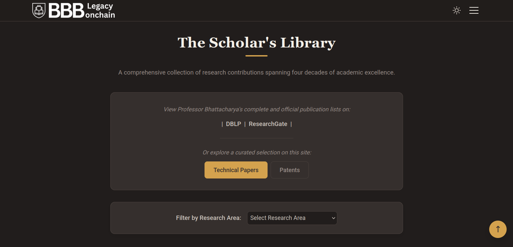

# BBB Legacy Onchain: A Digital Tribute




A permanent, decentralized digital archive and tribute celebrating the four-decade career, groundbreaking research, and profound mentorship of **Prof. Bhargab B. Bhattacharya**.

This project lives as a decentralized application, accessible via its blockchain domain **[bbblegacy.onchain](https://www.google.com/url?sa=E&q=https%3A%2F%2Fbbblegacy.onchain)** and permanently stored on the **InterPlanetary File System (IPFS)**.

- **Live IPFS Gateway Link:** https://ipfs.io/ipfs/bafybeiaaj3dvrzhdjwexgmkzlq2t4mlevqjzporrkchvubk5nih5ixxkay/
- **Previous Versions:**
  - https://ipfs.io/ipfs/bafybeidbxei27trk7vtmbqtldww67zzab4cv3acdprdep4spv56zzxtw7y/
  - https://ipfs.io/ipfs/bafybeicisfwrpr4fv46jms5ogwer4oe5ndpg53opixuuxbyl4bcpwlwcpy/

The web link can be accessed through any desktop browser like **firefox/chrome/edge** etc.

the blockchain domain [bbblegacy.onchain](bbblegacy.onchain) can be accessed using **Brave** browser (Desktop Version) that allows web3 DNS out-of-the-box. 

## A Note on the Development Philosophy

This website was built with heart, speed, and a clear vision: to create a beautiful and functional tribute. It is a prime example of **"vibe-driven development"**, a process where the final user experience and the emotional intent of the project were prioritized over perfect, textbook code structure. 

In the spirit of using modern tools to achieve this vision, the project was crafted as a **human-AI collaboration**. Much of the boilerplate code, refactoring, and problem-solving was handled with the assistance of AI development tools. This allowed the primary focus to remain on the creative and human elements. As such, you'll find that the code is straightforward and effective, but not necessarily a model of enterprise-grade architecture. Some parts are more "duct tape and dreams" than they are "rigorously-engineered." We acknowledge this with humility and pride. It's a testament to building something that works and matters. 

We welcome contributions, refactoring, and suggestions that can improve the codebase without compromising the spirit and aesthetic of the site.

## Core Features & Strengths

This is a **fully client-side application with zero external dependencies**, making it incredibly lightweight, fast, and portable.

- **Fully Responsive Design:** A seamless experience on desktop, tablet, and mobile devices.

- **Dark Mode:** A beautiful, persistent dark mode theme for comfortable viewing.

- **Interactive Image Gallery:** A smooth, scrollable "filmstrip" gallery with a full-screen lightbox modal.

- **Dynamic Content Filtering:** The "Scholar's Library" allows users to filter decades of technical papers by research area.

- **Smooth Scrolling & Animations:** Subtle fade-in animations and smooth navigation create a polished, modern feel.

- **Zero Dependencies:** Written in pure HTML, CSS, and Vanilla JavaScript. No frameworks, no build steps. This makes it exceptionally fast and easy to maintain.

## Tech Stack

- **HTML5:** For semantic and accessible content structure.

- **CSS3:** Modern CSS featuring Custom Properties (Variables), Flexbox, and Grid.

- **Vanilla JavaScript (ES6+):** For all interactivity.

- **IPFS:** For decentralized and permanent file storage.

- **Polygon:** The blockchain that powers the .onchain domain identity.

## Getting Started (Local Development)

Because this is a static website with no build process, running it locally is incredibly simple.

1. **Clone the repository:**
   
   ```
   git clone https://github.com/biplabro/bbb_legacy_onchain.git
   ```

2. **Navigate to the directory:**
   
   ```
   cd bbb_legacy_onchain
   ```

3. **Open the index.html file** in your browser. For the best experience, use a local server extension like "Live Server" for VS Code.

## Architectural Notes & The Web3 Component

### Strengths of a "Client-Side Only" Approach

- **Incredible Performance:** With no server-side processing, the site loads almost instantly.

- **Ultimate Portability:** The entire website can be hosted on any static service or decentralized network.

- **Simplicity & Maintainability:** The lack of a complex toolchain means anyone with basic web development knowledge can contribute.

### The Role of IPFS and a Blockchain Domain

Hosting on a decentralized stack is powerful but introduces a unique workflow.

1. **Permanent Storage (IPFS):** The site's files are stored on IPFS, a peer-to-peer network. This ensures they cannot be easily taken down and will exist as long as the network exists. Every time the site is updated, a new Content Identifier (CID) is generated for the new version.

2. **The Problem of Changing CIDs:** This presents a challenge: how do users find the latest version if the "address" (the CID) changes with every update?

3. **The Blockchain Domain Solution (Base):** The **bbblegacy.onchain** domain solves this problem. It is a Web3 domain registered as an NFT on the **Base blockchain**. This domain acts as a permanent, human-readable pointer that can be programmatically updated to always point to the latest IPFS CID. This elegant solution combines the permanent storage of IPFS with a stable, user-friendly address, creating a truly decentralized and resilient website.

4. **Requirement for Social Previews:** A key takeaway is that social media crawlers (for LinkedIn, WhatsApp, etc.) require **absolute URLs**. The og:image and og:url meta tags in index.html must use the full, absolute IPFS gateway URL to the content, not relative paths.

## Contributing

Pull requests are welcome! This project was built with love, and we invite you to help us improve it. For major changes, please open an issue first to discuss what you would like to change.

Some potential areas for contribution:

- **Refactoring CSS:** Improving organization and reducing redundancy.

- **Enhancing Accessibility (A11y):** Adding ARIA attributes and ensuring the site is fully navigable for all users.

- **Code Comments & Documentation:** Improving the clarity of the JavaScript functions.

- **Adding New Content:** If you have new photos, papers, or tributes to add, please share them.

## License

This project is licensed under the [GPL v3.0](https://github.com/biplabro/bbb_legacy_onchain/blob/main/LICENSE).
